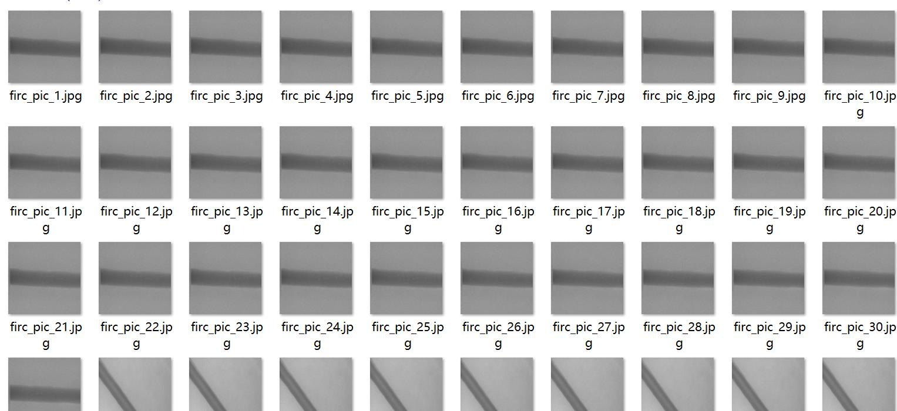
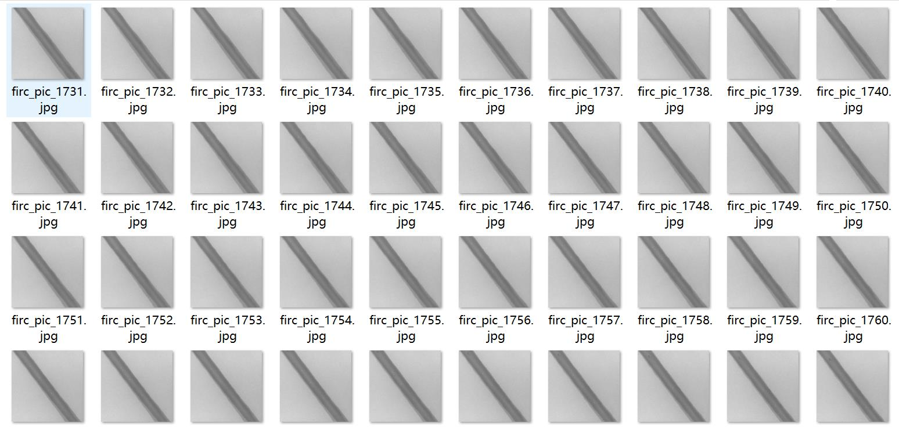
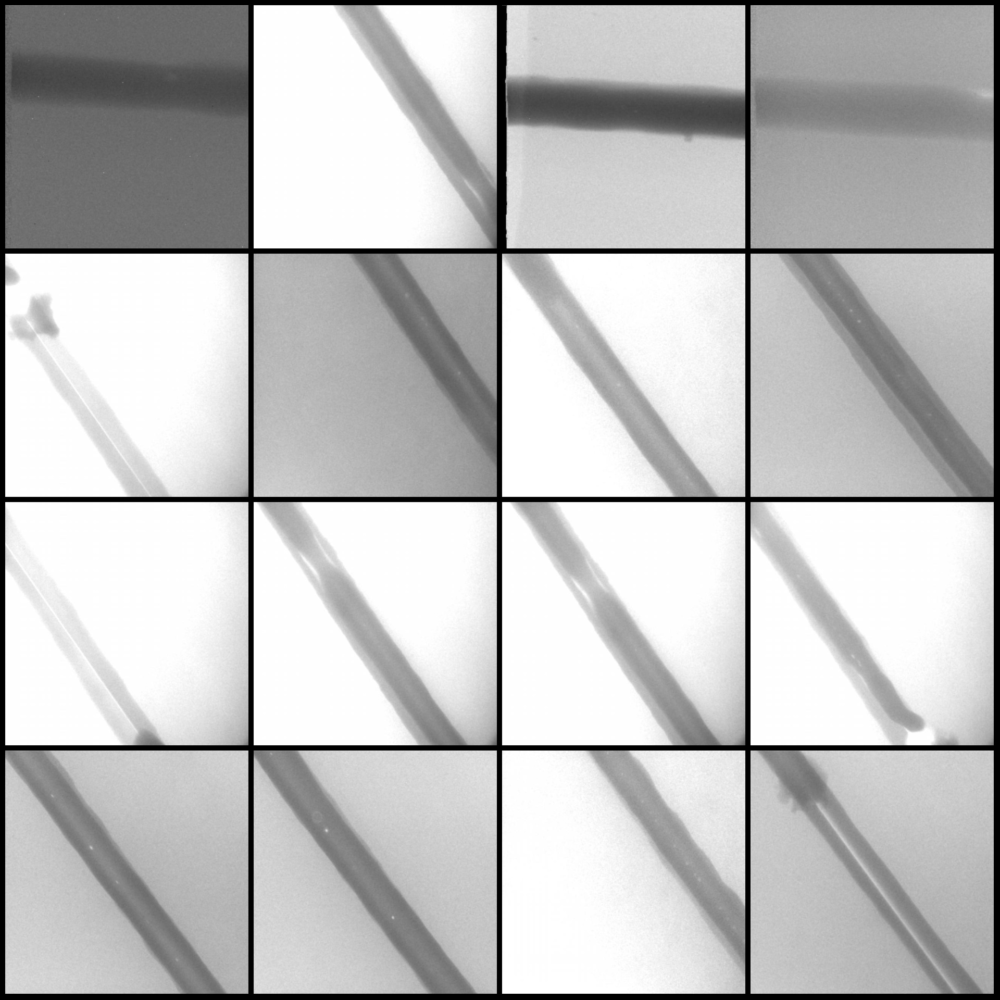
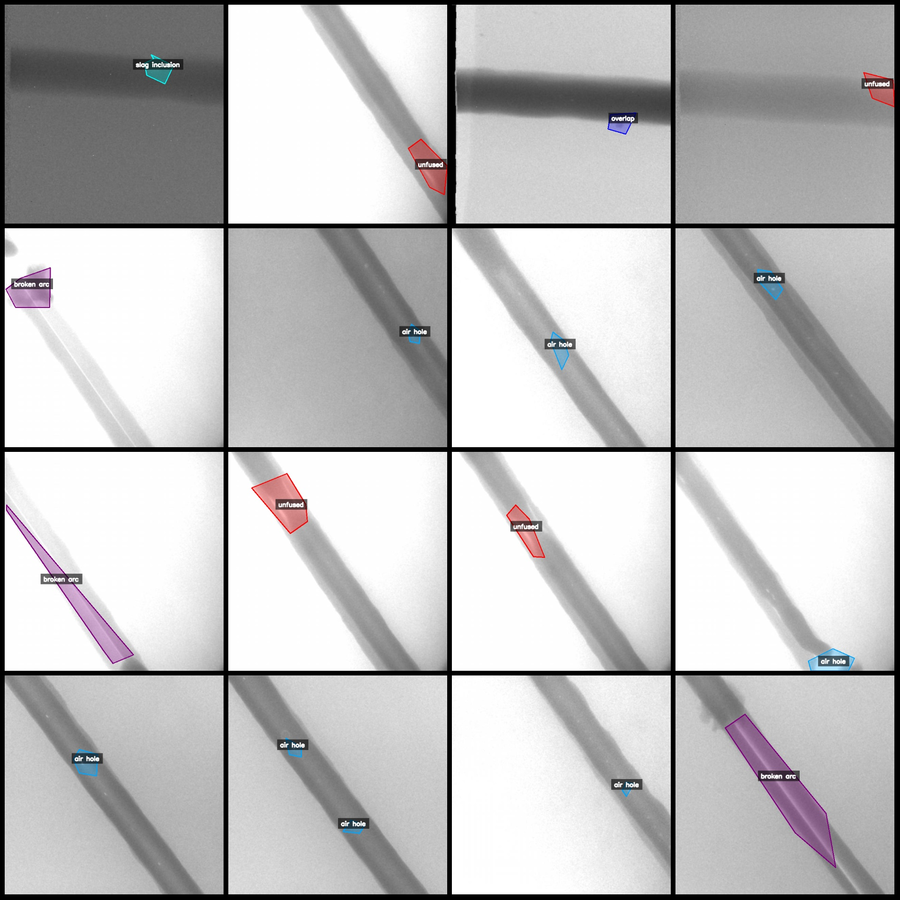
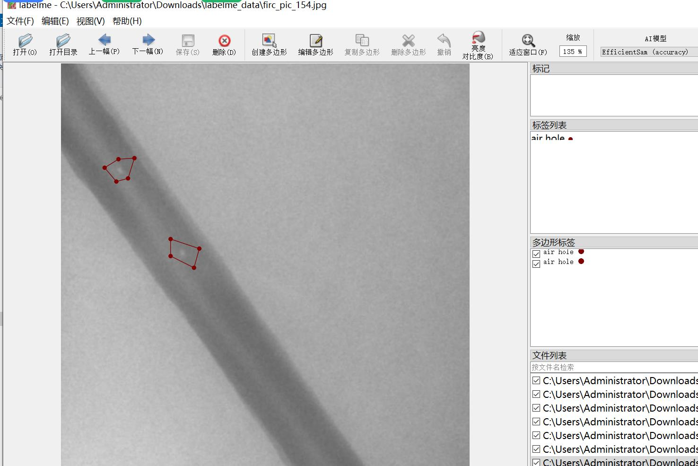

# Steel Pipe X-ray Image Defect Identification and Segmentation Data Set in LabelMe format, 3337 Images in 8 Categories

Dataset format: LabelMe format (excluding mask files, containing only JPG images and corresponding JSON files)
Number of images (JPG file count): 3337
Number of annotations (JSON file count): 3337
Number of annotation categories: 8
Annotation category names: ["air hole", "air hole hollow", "slag inclusion", "bite edge", "broken arc", "crack", "overlap", "unfused"]
Box counts for each category:
Air Hole Count = 1601
Air Hole Hollow Count = 617
Slag Inclusion Count = 97
Bite Edge Count = 34
Broken Arc Count = 499
Crack Count = 115
Overlap Count = 212
Unfused Count = 413
Total box count: 3588
Annotation tool used: labelme=5.5.0
Image resolution: 640x640
Annotation rules: Polygon is drawn around the category for annotation.
Important Notice: The dataset can be opened and edited using LabelMe, but the JSON dataset needs to be converted into a mask or Yolo format or COCO format for instance segmentation or semantic segmentation.
Special Notice: This dataset does not guarantee the accuracy of the trained models or weight files.
Image previews:
Annotation examples:
Original image:
Annotation drawing result:
## Images

Here is a pay link on Stripe ( https://buy.stripe.com/3cs8yP7sY87d0vu9AB ). Please contact me lonlonago@foxmail.com after funding $89, and I will send you a complete data files , thank you!

